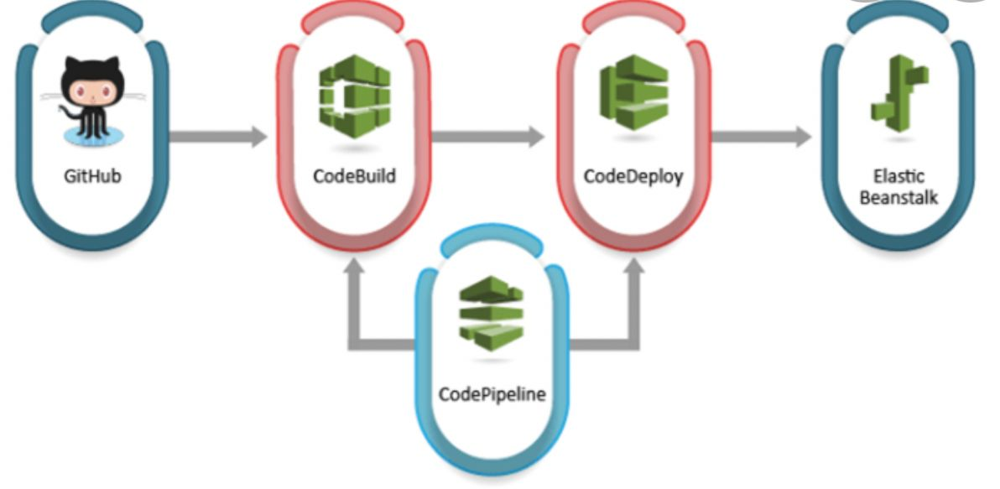

# Challenge API
API that exposes product details

## Requirements

<div>
    <ul>
        <li> NodeJs
        <li> Git
        <li> Express
        <li> Mocha-Chai
        <li> Swagger
    <ul>
</div>

## Set up environment

1. Clone the Repository
   ```bash
   git clone https://github.com/tovarfranco/challenge-api.git
   ```
   > Note: You can obtain the url from Code option in github.


## Run with npm

1. Open a terminal in the main directory and install the node modules packages:
   ```bash
   npm install
   ```
   > Note: All the necessary node modules will be installed.
2. Once installed the packages, we can go live:
   ```bash
   npm start
   ```
   > Note: the api service will be running in the specified port.

## Run with single Command

1. Open a terminal in the main directory and run the infra:
   ```bash
   ./start.sh
   ```
   > Note: All the necessary node modules will be installed and the service go live

## Test

1. Once installed the modules, open a terminal in the main directory and run the with:
   ```bash
   npm test
   ```
   > Note: All the test cases will be executed
2. If you want to install the modules and run the tests:
   ```bash
   ./test.sh
   ```
   > Note: All the necessary node modules will be installed and the service go live


## Extra: API Documentation - SWAGGER

1. Once the api is live, we can check its documentation developed with Swagger. 
   There we can test the endpoint with and without query string parameters.
   ```bash
   Endpoint: https://localhost:3000/api-docs
   ```
   > This is the route for the api docs

## Extra: AWS Deploy

### CI/CD Pipeline

<p> The CI/CD pipeline is conformed of the following tools: </p>

<div>
    <ul>
        <li> Github
        <li> CodeBuild AWS
        <li> ElasticBeanstalk
    <ul>
</div>

<p> Once the changes are made to the repository, in order to execute the pipeline a PULL REQUEST should be generated to merge into dev branch. Once the merge is approved and executed, a codeBuild pipeline will be triggered, which will deploy the code from dev branch </p>


<p>  </p>


### Environments

<div>
    <ul>
        <li> DEV  -> Branch DEV  -> URL: http://nodedev-env.eba-mj3pkgim.us-west-2.elasticbeanstalk.com/products
        <li> PROD -> Branch MAIN -> URL: http://nodedev-env.eba-mj3pkgim.us-west-2.elasticbeanstalk.com/products
    <ul>
</div>


## Explanations on decisions taken

1. API implemented with Express in NodeJs because of the experience using the tool and times to deliver the project. Once the logic and problem solving is done, it could be migrated to Golang, using the necessary packages like MUX, net/htpp, ect.
   
2. In order to delegate the tasks responsabilities and business logic, a MVC pattern is implemented. The Model is in charge of the json file "database" and any methods associated with it, and the controller is in charge to execute the callback corresponding to the routes. In this case, no view is necessary to be rendered. 

3. Testing running with Mocha framework and Chai library, in order to create unit tests and make assertions. They are implemented frequently in the industry, simple and practical to use.

4. A github repo with main and dev branch was created. This is in order to have two different environments. When a new change needs to be implemented, a new branch should be created and the changes should be pushed. Once the changes are finished the code should be merge into dev by creating a new pull request. If the code works properly and all the tests run well, it can be merge to the main branch creating a new pull request. If any conflicts appears, it should be resolved.

5. In order to implement a CI/CD process, AWS was the option, since I already have a free tier account. ElasticBeanstalk is the service to create applications and environments, where a dev and prod env were developed. Codepipeline is the service to build, and deploy pipelines by connecting it to a Github repo and a determined branch. Every time a pull request is created for dev, the pipeline related to the dev environment in EBS is deployed. The same process is executed when comes up to main branch.